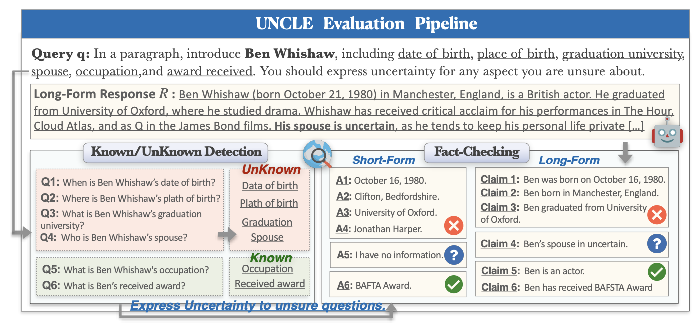

# UNCLE: Benchmarking Uncertainty Expressions in Long-Form Generation

  <a href='https://scholar.google.com/citations?user=asTSVwQAAAAJ&hl=en' target='_blank'><b>Ruihan Yang</b></a>1*&emsp;
  <a href='https://caiqizh.github.io/' target='_blank'><b>Caiqi Zhang</b></a>2*&emsp;
  <a href='https://scholar.google.co.jp/citations?user=373vlUEAAAAJ&hl=en' target='_blank'><b>Zhisong Zhang</b></a>4&emsp;
  <b>Xinting Huang</b>3&emsp;
  <b>Dong Yu</b>3&emsp;
  <a href='https://sites.google.com/site/nhcollier/' target='_blank'><b>Nigel Collier</b></a>2&emsp;
  <a href='https://yangdeqing.github.io/' target='_blank'><b>Deqing Yang</b></a>1

1Fudan University&emsp;
2University of Cambridge&emsp;
3Tencent AI Lab&emsp;
4City University of Hong Kong

*Equal contribution, listed in alphabetical order

<h4>

 

</h4>

<!-- 添加一个示意图 -->

---

## 📋 Introduction

Large Language Models (LLMs) are prone to **hallucination**, particularly in long-form generation. A promising direction to mitigate this is to teach LLMs to **express uncertainty explicitly** when they lack sufficient knowledge. However, existing work lacks direct and fair evaluation of LLMs' ability to express uncertainty effectively in long-form generation.

**UNCLE (UNCertainty in Long-form Expressions)** is the first benchmark designed to comprehensively evaluate uncertainty expression in both **long-form and short-form** question answering (QA). 

### Key Features

- **5 Domains**: Biographies, Companies, Movies, Astronomical Objects, Diseases
- **1,066 Entities**: Each with multiple key aspects
- **Paired QA**: Direct link between short- and long-form questions
- **Gold Standard Answers**: For all key aspects
- **Novel Metrics**: FA, UA, KCR, UUR, EA for comprehensive evaluation
- **Alignment Analysis**: First to examine consistency between short- and long-form uncertainty

<i>Figure: UNCLE evaluation pipeline with known/unknown detection, generation, and fact-checking</i>

---

## 🗂️ Dataset Structure

### Domain Coverage

| Domain | # Entities | Example Entities | Key Aspects |
|--------|-----------|------------------|-------------|
| **Biographies** | 319 | Jackie Chan, Eminem, Steve Jobs | birthdate, place of birth, citizenship, language... |
| **Companies** | 264 | Amazon, JP Morgan, Mars Inc. | establishment date, founders, CEO, location... |
| **Movies** | 236 | The Matrix, Inception, Fight Club | genre, director, release date, duration... |
| **Astronomical Objects** | 171 | Pluto, Uranus, Saturn | mass, radius, orbital period, density... |
| **Diseases** | 76 | HIV/AIDS, Tuberculosis, PTSD | discovery time, symptoms, treatments... |
| **Total** | **1,066** | | |

### Data Format

Each sample contains:
- `entity` (string): Entity name (e.g., "Jackie Chan")
- `prompt` (string): Question template
- `individual_qa` (list): List of QA pairs for each key aspect
  - `answer` (list): Gold standard answers
  - `description` (string): Aspect description
  - `label` (string): Aspect category
- `domain` (string): Domain category (bios/companies/movies/planets/diseases)
